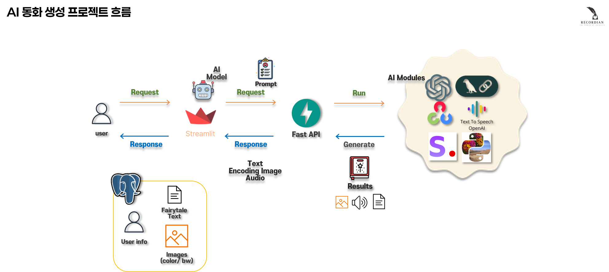
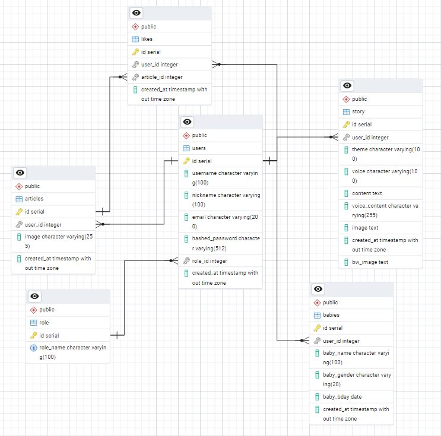

# 📖 AI 동화 생성봇

아이를 위한 맞춤형 동화를 생성해주는 AI 기반 웹 애플리케이션입니다.  
**동화 생성, TTS 음성 읽기, 이미지 변환, 자장가 추천, 유튜브 영상 검색 등** 다양한 기능을 제공합니다.
<br>**Python** 으로만 만든 프로젝트 입니다.

> ⏱️ 프로젝트 기간: **2025년 5월 17일 ~ 2025년 6월 12일**  
> 🛠️ 주요 언어: `FastAPI`, `Python`, `PostgreSQL`

<br>


---

## 🚀 주요 기능

| 기능 구분 | 상세 내용 |
|----------|-----------|
| 👶 **회원 & 아이 관리** | - 회원가입/로그인/탈퇴<br>- 아이 등록 및 생년월일 기반 출생일 계산 |
| 📘 **동화 생성** | - 테마를 선택하면 AI가 동화 생성<br>- GPT-4o-mini 사용 (max_tokens 16384) |
| 🔊 **TTS 음성 읽기** | - OpenAI TTS 사용<br>- 다양한 목소리 선택 (10종 이상)<br>- 재생 속도 조절 기능 |
| 🎨 **이미지 생성 & 변환** | - Stability AI 기반 이미지 생성<br>- 흑백 변환을 통한 컬러링북 스타일 제공 |
| 🖼 **갤러리** | - 사용자별 이미지 및 동화 확인<br>- 다운로드 및 공유 가능 |
| 🎵 **자장가 찾기** | - 테마별 무료 자장가 음원 추천 (Jamendo API 사용) |
| 📺 **유튜브 영상 추천** | - 테마 관련 유튜브 영상 5개 자동 검색 및 제공 |

---

## 🔧 사용 기술 스택

| 영역 | 기술 스택 |
|------|------------|
| **Frontend** | Streamlit |
| **Backend** | FastAPI (비동기 REST API), BackgroundTasks, FastAPI Session Middleware |
| **Database** | PostgreSQL, SQLAlchemy (ORM) |
| **AI 모델** | OpenAI GPT-4o-mini(동화 생성, 프롬프트 생성), TTS API(음성 변환),  Stability AI (이미지 생성)|
| **API 통합** | Jamendo API (음악), YouTube API (영상 추천), SMTP (이메일 발송) |
| **이미지 생성** | Stability AI (DALL·E 3 → 교체됨) |
| **유효성 검증** | Pydantic (입력 검증), re 정규표현식, 수동 유효성 로직 |
| **보안 밎 인증** | 비밀번호 해싱(Passlib - bcrypt), 중복 방지 로직, 로그인 세션 처리 |
| **상태 관리** | st.session_state, dotenv (.env), st.secrets (API 키 관리) |
| **이미지 처리** | OpenCV, base64 인코딩, ZIP 압축 |
| **로깅 시스템** | Python logging 모듈 기반 info/error 수준 로그 기록 |
| **기타 기능** | 이메일 발송, 임시 비밀번호, 사용자 정보 수정, 회원 탈퇴, 컨텐츠 삭제 등 |


---

## 📌주요 기술적 특징 및 구현 목적
| 요소         | 설명                                  |
| ------------- | ------------------------------------ |
| **비동기 API 설계** | FastAPI 사용                           |
| **ORM 관리**    | SQLAlchemy로 DB 모델 관리                 |
| **정교한 입력 검증** | `pydantic` 모델로 요청값 검증                |
| **유저 인증 및 보안**  | 같은 유저 내 동일 이름 아이 등록 방지               |
| **예외 처리/롤백**     | `try-except`, `rollback`, 사용자 친화 메시지 |
| **AI 연동 기능**     | 텍스트 동화 → 이미지/음성 변환까지 전체 생성 흐름 자동화, 콘텐츠 저장 및 다운로드 지원 |
| **운영 환경 고려**   | .env 설정, 로깅, API 키 분리 등 실 서비스 운영을 고려한 구조             | 
| **파일 처리 기능**   | 이미지 base64 인코딩, ZIP 다운로드, 소셜 공유 URL 자동 생성 등 실용 기능 다수 내장             | 


---

## 💻구현 의도 및 활용 가능성
이 프로젝트는 단순한 CRUD를 넘어 실제 운영 서비스에서 요구되는 요소들을 적극 반영한 실무형 백엔드 아키텍처입니다.
- 입력 검증, 보안, 세션 처리, 예외 처리, 로깅 등 실전에서 필요한 기능을 포함
- AI 기반 콘텐츠 생성 및 관리 기능 포함 → SaaS 및 콘텐츠 플랫폼 백엔드로 확장 가능
- 실무 경험 없이도 체계적인 인증/회원 관리 시스템을 처음부터 끝까지 경험할 수 있음
- 팀 프로젝트, 기술 포트폴리오, 서비스 MVP 개발에 바로 활용 가능

---

## 프로젝트 흐름



---

## ERD


| 모델	| 설명	| 주요 필드	| 관계 |
|-------|-------|-----------|------|
| **User**	| 회원 정보 저장	| username, email, role_id, created_at	| stories, articles, babies, likes, role |
| **Role**	| 사용자 역할(권한) 구분	| role_name	| users (1:N) |
| **Baby**	| 아이(또는 태아) 정보	| baby_name, baby_gender, baby_bday	| user (N:1) |
| **Story**	| AI가 생성한 동화 데이터	| theme, voice, content, image, voice_content	| user (N:1) |
| **Article**	| 사용자 게시글 (갤러리 등) |	image, created_at	| user (N:1), likes (1:N) |
| **Like**	| 좋아요 기록	| user_id, article_id	| user, article (각각 N:1) |

---

## 🆕 v1.2 변경사항 (2025.06.12)

- 🎨 **이미지 생성 모델 변경:** DALL·E → Stability AI
- 🧠 **모델 교체:** gpt-3.5-turbo → gpt-4o-mini (max_tokens: 16384)
- 🗣 **TTS 업데이트:** 목소리 3종 추가, 임시 파일 없이 실시간 음성 재생 지원

---

## 📁 프로젝트 구조 예시

```bash
📦fairytale_web_ver
├── controllers/        # 앱 관련 주요 기능 구현
├── emails/             # 회원 활동 관련 email 발송 기능 구현
├── frontend/           # Streamlit 앱
    ├── pages/          # Streamlit 페이지들
    ├── home.py         # Streamlit 메인 페이지
├── img/                # 프론트엔드에 사용되는 이미지
├── models_dir/         # 데이터베이스 관련
├── scheme_files/       # 아이, 컨텐츠, 사용자 관련 클래스
├── ai_server.py        # ai 서버 (FastAPI)
├── main.py             # 앱의 진입점
├── requirements.txt    # 사용된 모듈, 라이브러리 버전 관리용
└── README.md           # 프로젝트 설명
```
---

## 📖 프로젝트 목표 및 학습 과정
- FastAPI + PostgreSQL을 활용한 CRUD 구현
- 사용자별 데이터 분리 및 보안 처리
- 백엔드와 프런트엔드 연동 경험
- BackgroundTasks를 이용한 비동기 이메일 전송
- 다양한 AI API 활용

---

## 📝 상세 설명 (블로그)
| 주제 | 링크 |
|------|------|
| 🔧 프로젝트 개요 | [바로가기](https://puppy-foot-it.tistory.com/909) |
| 📁 controller 디렉터리 설명 | [바로가기](https://puppy-foot-it.tistory.com/912) |
| 📁 email 디렉터리 설명 | [바로가기](https://puppy-foot-it.tistory.com/913) |
| 📁 frontend 디렉터리 설명 | [바로가기](https://puppy-foot-it.tistory.com/914) |
| 📁 models_dir 디렉터리 설명 | [바로가기](https://puppy-foot-it.tistory.com/915) |
| 📁 scheme_files 디렉터리 설명 | [바로가기](https://puppy-foot-it.tistory.com/916) |
| 📄 main, ai_server, 기타 설명 | [바로가기](https://puppy-foot-it.tistory.com/917) |


---

## 🧭 향후 계획 (Roadmap)

-   [ ] **관리자 모드 도입:** 관리자 모드를 도입하여 관리자가 사용자의 모든 컨텐츠를 관리할 수 있도록 개선
-   [ ] **대시보드 적용:** 사용자의 활동을 기록하고 보여줄 수 있는 대시보드 도입
-   [ ] **소셜로그인 구현:** 사용자의 편의성을 극대화하기 위해 소셜로그인 구현
-   [ ] **게시판 도입**: 생성된 흑백 이미지를 사용자가 직접 색칠한 후 게시판에 업로드하여 좋아요 및 댓글 기능이 가능한 커뮤니티 기능 구현
-   [ ] **CI/CD**: 실제 사용자를 위한 클라우드 서버로의 배포 및 자동화된 배포 파이프라인 구축
---


## 📜 라이선스 (License)

이 프로젝트는 [MIT License](LICENSE) 를 따릅니다.
